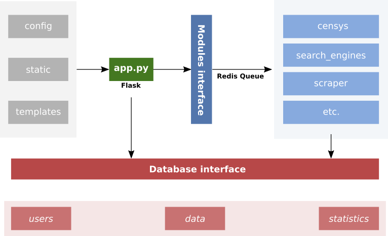

# About
Next step :
    - Full integrate Celery and commit
    - Full clean code and commit
    - Run scrapy async

# About
The **exposer** is an numeric intelligence framework that provides users multiple methods to gather data on a specific target. This is company-oriented, and there are not people search feature. The framework mainly helps finding confidential data using OSINT methods, but also "hacking" methods such as authenticating with default users/passwords.

## Architecture
The framework is developped with Python 3. The web server is built with Flask and launches tasks using RedisQ. The database is PostgreSQL.


## Features

# Google Search docs
Add URLs here

# Bing Search docs
https://www.microsoft.com/en-us/bing/apis/bing-web-search-api
https://www.microsoft.com/en-us/bing/apis/pricing
https://docs.microsoft.com/en-us/bing/search-apis/bing-web-search/overview
https://docs.microsoft.com/en-us/bing/search-apis/bing-web-search/reference/query-parameters

# Yahoo Search docs
https://api.search.yahoo.com/search?p=site:metsys.fr%20filetype:pdf
Look for: <div="web">

# Baidu Search docs
# Yandex Search docs
# DuckDuckGo Search docs
# Ask Search docs
# Ecosia Search docs
# Aol Search docs
# StartPage docs


# Use
## Run prod
```bash
docker compose build --no-cache
docker compose up
```

## Run tests (TODO)
In order to run testing code, create a test file and insert the code you want to test as shown below.
```
### CODE TO RUN
try:
    import uwsgi
    IN_UWSGI = True
except ImportError:
    IN_UWSGI = False

if IN_UWSGI:
    # Write code here
    print("Code to run")
    sys.exit(1)
```

Assuming the code above is located in ```./modules/scrapym/test.py```, you should configure the uwsgi.ini file like this :
```
[test-scrapym]
# Listener
http = :9000

# Where to run
wsgi-file = modules/scrapym/test.py
master = true

# How to run
single-interpreter = true
```

Then you can run your test with the following command :
```uwsgi --ini uwsgi.ini:test-scrapym```


## Access database
Scrapy to look for files on non indexed domains
```
sudo -u postgres psql

-- List all databases
# \l
                                  List of databases
   Name    |  Owner   | Encoding |   Collate   |    Ctype    |   Access privileges
-----------+----------+----------+-------------+-------------+-----------------------
 files     | postgres | UTF8     | fr_FR.UTF-8 | fr_FR.UTF-8 |
 postgres  | postgres | UTF8     | fr_FR.UTF-8 | fr_FR.UTF-8 |

-- Connect to a database
# \c <db_name>

-- List all tables in the database
# \dt

```